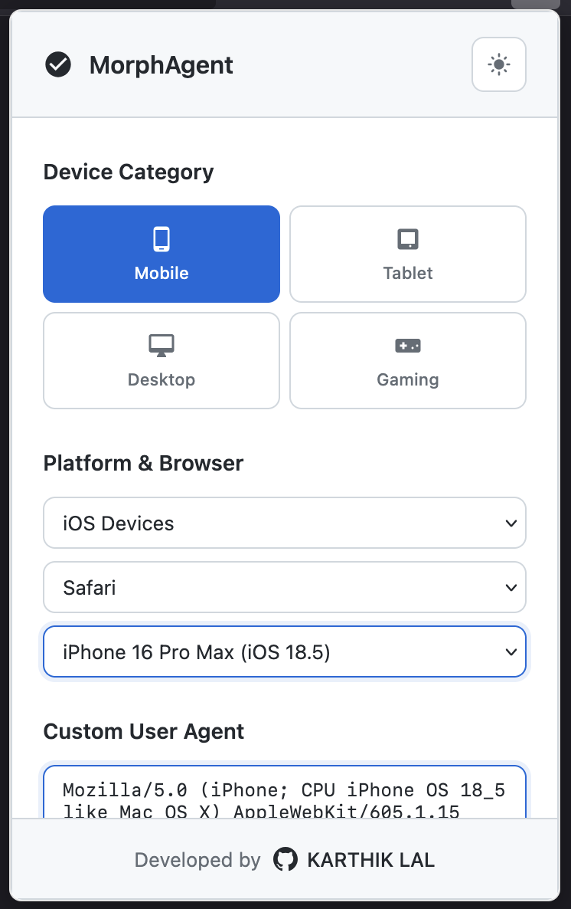
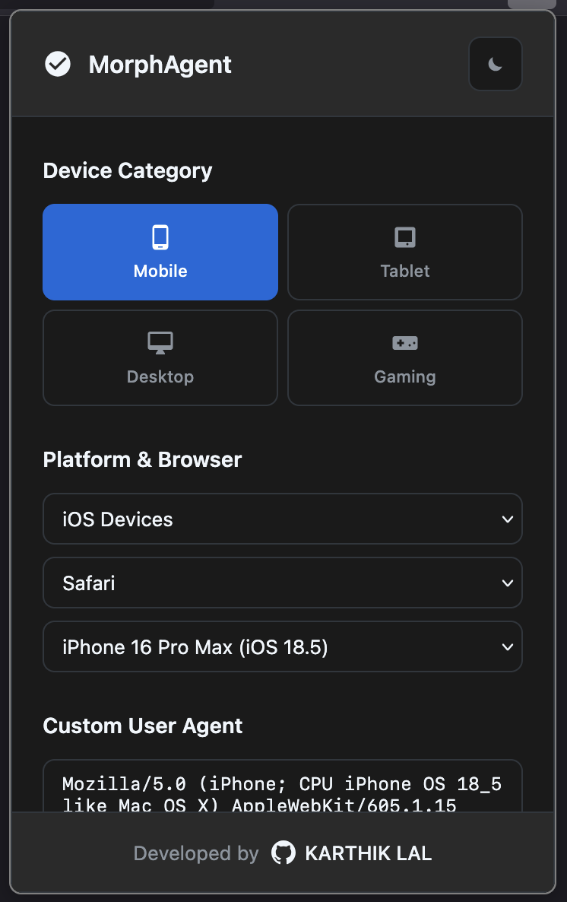
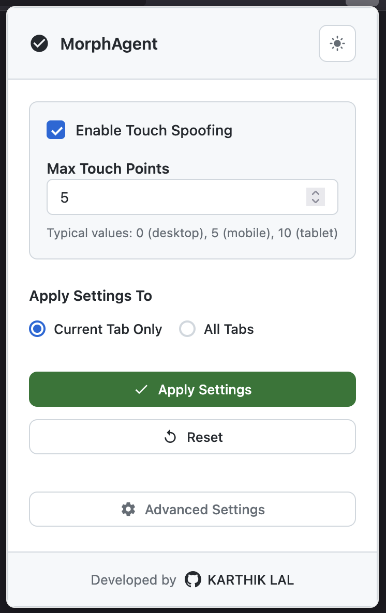
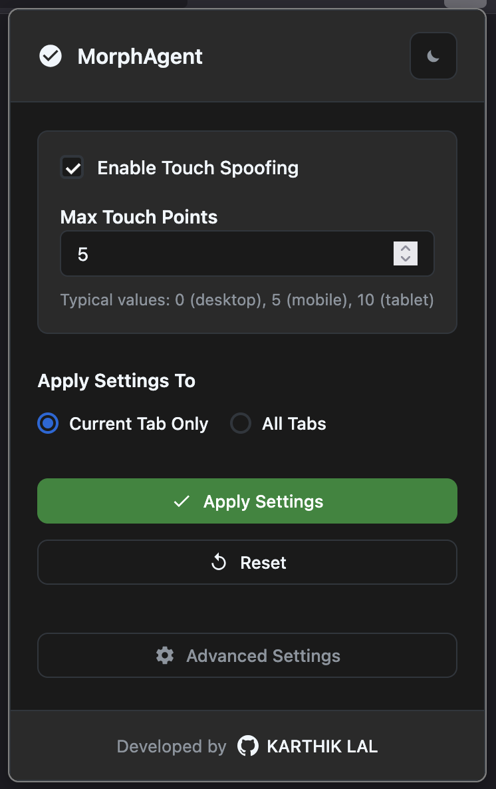

<div align="center">


# MorphAgent

> **Modern User Agent & Anti-Fingerprinting Extension**  
> Professional-grade browser spoofing & detection shield for Firefox


---

## **Official Firefox Extension**

MorphAgent is now available on the official Mozilla Firefox Add-ons store.

</div>

## **Screenshots**

<div align="center">

<table>
   <tr>
      <th colspan="2" style="text-align:center; font-size:1.1em;">Main Interface (Light & Dark Mode)</th>
   </tr>
   <tr>
      <td>
         
         <div>Light Mode</div>
      </td>
      <td>
         
         <div>Dark Mode</div>
      </td>
   </tr>
   <tr>
      <th colspan="2" style="text-align:center; font-size:1.1em;">Touch Points Configuration</th>
   </tr>
   <tr>
      <td>
         
         <div>Touch Points (Light)</div>
      </td>
      <td>
         
         <div>Touch Points (Dark)</div>
      </td>
   </tr>
</table>

</div>

---

## **Key Features**

### Modern Interface
- Dark/light themes with smooth transitions
- Responsive device grid with intuitive category selection (Mobile, Tablet, Desktop, Gaming)
- Three-tier cascading selection: Platform → Browser → Profile
- Browser-type filtering (Chrome, Firefox, Safari, Edge) with platform-aware visibility
- Apply scope selector: **Current Tab** or **All Tabs**
- UI state persistence — popup remembers your last selection
- Advanced settings page for power users

### Advanced Spoofing
- User Agent switching with **130+ modern profiles**
- HTTP header interception & JavaScript `navigator` property spoofing
- Touch point spoofing with customizable `maxTouchPoints` (0–20)
- Per-website rules with wildcard pattern matching for automatic profile switching
- Block list support to disable spoofing on sensitive sites
- JavaScript blocking (global & per-site) via HTTP-level + content-level enforcement
- Custom UA string input for any arbitrary user agent

### Detection Shield (14 Anti-Fingerprinting Protections)
- **Canvas fingerprint protection** — noise injection into `toDataURL()` and `toBlob()`
- **WebGL fingerprint protection** — spoofs GPU vendor/renderer strings
- **Screen dimension spoofing** — device-accurate width, height, colorDepth, pixelDepth
- **Hardware concurrency & device memory spoofing**
- **Plugin & MimeType array spoofing** — realistic plugin lists per browser
- **Network connection spoofing** — effectiveType, downlink, rtt, saveData
- **Battery API protection** — fake battery for mobile, removed for desktop
- **Permissions API interception** — notifications return `'prompt'`
- **WebDriver & automation marker removal** — cleans 14+ fingerprint properties
- **Language spoofing** — consistent `navigator.languages` and `navigator.language`
- **`window.chrome` object management** — present for Chrome/Edge, absent for Firefox/Safari
- **`Function.prototype.toString` cloaking** — all spoofed functions return `[native code]`

### Comprehensive Profiles
- Latest devices: iPhone 17 Pro Max, Galaxy S26 Ultra, Pixel 10 Pro XL, iPad Pro M5
- Modern browsers: Chrome 145+, Firefox 142+, Safari 26.3+, Edge 145+
- Current OS versions: iOS 19, Android 16, Windows 11, macOS Tahoe
- Gaming devices: PS5 Pro, Nintendo Switch 2, Steam Deck OLED 2, ROG Ally 2

---

## **Installation**

### **Official Firefox Extension**

Get MorphAgent directly from the Mozilla Firefox Add-ons store:

<a href="https://addons.mozilla.org/en-US/firefox/addon/morphagent/" target="_blank">
  
</a>

**Installation:**
1. Visit the [Firefox Add-ons Store](https://addons.mozilla.org/en-US/firefox/addon/morphagent/)
2. Click "Add to Firefox"
3. Confirm permissions
4. Start using MorphAgent from your toolbar

---

### **Manual Installation**

For development and testing:

1. **Download**: Clone or download this repository
   ```bash
   git clone https://github.com/karthik558/MorphAgent.git
   ```
2. **Load Extension**: Open Firefox and navigate to `about:debugging#/runtime/this-firefox`
3. **Install**: Click **"Load Temporary Add-on..."**
4. **Select**: Choose the `manifest.json` file from the downloaded folder
5. **Verify**: The MorphAgent icon should appear in your Firefox toolbar

---

## **Quick Start**

1. Click the MorphAgent icon in your Firefox toolbar
2. Select device category: Mobile, Tablet, Desktop, or Gaming  
3. Choose specific profile from the device grid
4. Toggle touch spoofing (automatically sets appropriate touch points)
5. Apply changes - refresh pages to see the new user agent

### Advanced Configuration
Click **"Advanced Settings"** for power-user features:
- **Website Rules**: Set automatic profiles for specific domains with wildcard support
- **Block List**: Disable spoofing on banking/sensitive sites
- **Tab-Specific Settings**: View, copy, and manage per-tab UA overrides
- **Import/Export**: Backup and share your configuration as JSON
- **Custom User Agents**: Enter any UA string manually
- **Open Firefox Debug**: Quick shortcut to `about:debugging`
- **Reset All Settings**: Factory reset with confirmation

---

## **Device Database (130+ Profiles)**

### Mobile Devices (50+ profiles)
- **iPhone**: 17 Pro Max, 17 Pro, 17 Air, 17 Plus, 17, SE 4th Gen (iOS 19)
- **Samsung**: Galaxy S26 Ultra/Plus/S26, Z Fold 7, Z Flip 7 (Android 16)
- **Google**: Pixel 10 Pro XL, Pixel 10 Pro, Pixel 10 (Android 16)
- **OnePlus 14**, **Xiaomi 16 Ultra**, **Nothing Phone (3)**

### Tablets (20+ profiles)
- **iPad**: Pro 13"/11" M5, Air 13"/11" M3 (iPadOS 19)
- **Samsung**: Galaxy Tab S11 Ultra/Plus (Android 16)
- **Microsoft**: Surface Pro 12 (Windows 11)

### Desktop (40+ profiles)
- Chrome 145+ (Windows 11, macOS, Linux)
- Firefox 142+ (All platforms)
- Safari 26.3+ (macOS Tahoe)
- Edge 145+ (Windows, macOS)
- Opera 117+, Brave 1.78+

### Gaming Devices (16 profiles)
- **Console**: PS5 Pro (System 9.00), Xbox Series X/S, Nintendo Switch 2
- **Handheld**: Steam Deck OLED 2, ROG Ally 2, Lenovo Legion Go S, MSI Claw 8 AI+

---

## **Privacy & Security**

- **Local Storage Only** — No data collection, analytics, or tracking
- **Detection Shield** — 14 anti-fingerprinting protections to reduce your digital footprint
- **Block List Protection** — Safeguard banking and sensitive sites from spoofing
- **JS Blocking** — Global and per-site JavaScript execution control
- **Open Source** — Full transparency and community auditing
- **Minimal Permissions** — Only requests necessary browser APIs

---

## **What's New in v3.1.0**

- **130+ device profiles** — up from 70+, now including 2026 flagships
- **Detection Shield** — 14 anti-fingerprinting protections (canvas, WebGL, screen, battery, plugins, and more)
- **Browser-type filtering** — filter profiles by Chrome, Firefox, Safari, or Edge
- **Tab-specific settings viewer** — view, copy, and manage per-tab overrides
- **Apply scope selector** — choose between Current Tab and All Tabs
- **Canvas & WebGL fingerprint protection** — noise injection and GPU spoofing
- **Screen dimension spoofing** — device-accurate resolution overrides
- **Network & hardware spoofing** — connection type, CPU cores, device memory
- **UI state persistence** — popup remembers your selections across reopens
- **Dynamic version badge** — auto-reads version from manifest

---

## **Known Limitations**

- **Firefox Only**: Designed exclusively for Firefox with Manifest V2
- **Content Security Policy**: Some sites with strict CSP may limit content script injection
- **Touch API Scope**: Only affects `navigator.maxTouchPoints`
- **Banking Sites**: Recommended to use block list for financial websites

---

## **Development**

### Contributing
1. Fork the repository
2. Create a feature branch
3. Test on Firefox
4. Submit a pull request

### Project Structure
```
MorphAgent/
├── manifest.json              # Extension manifest (v3.1.0)
├── popup.html                 # Main popup interface
├── popup.css                  # Popup styles
├── advanced-settings.html     # Advanced settings page
├── css/
│   ├── popup.css              # Popup stylesheet
│   └── advanced-settings.css  # Settings stylesheet
├── js/
│   ├── popup.js               # Popup logic & UI
│   ├── background.js          # Core spoofing & header interception
│   ├── content.js             # Navigator/fingerprint spoofing (14 protections)
│   ├── profiles.js            # Device database (130+ profiles)
│   └── advanced-settings.js   # Settings page logic
├── icons/                     # Extension icons
└── src/                       # Screenshots & assets
```

---

## License

This project is licensed under the MIT License - see the [LICENSE](LICENSE) file for details.

**MIT License** - Free to use, modify, and distribute

---

## Author

**Developed by KARTHIK LAL**
- GitHub: [@karthik558](https://github.com/karthik558)
- Design: Modern interface with dark/light themes
- Features: Advanced per-site spoofing with Detection Shield (14 protections)
- Database: Comprehensive device profile collection (130+ profiles)
- UX: Enhanced user experience and professional polish

---

<div align="center">

**Built with ❤️ for developers who value browser privacy and testing**

*MorphAgent - Transform your browser identity with professional-grade spoofing & anti-fingerprinting*

**⭐ Star this repo if MorphAgent helps your development workflow!**

</div>