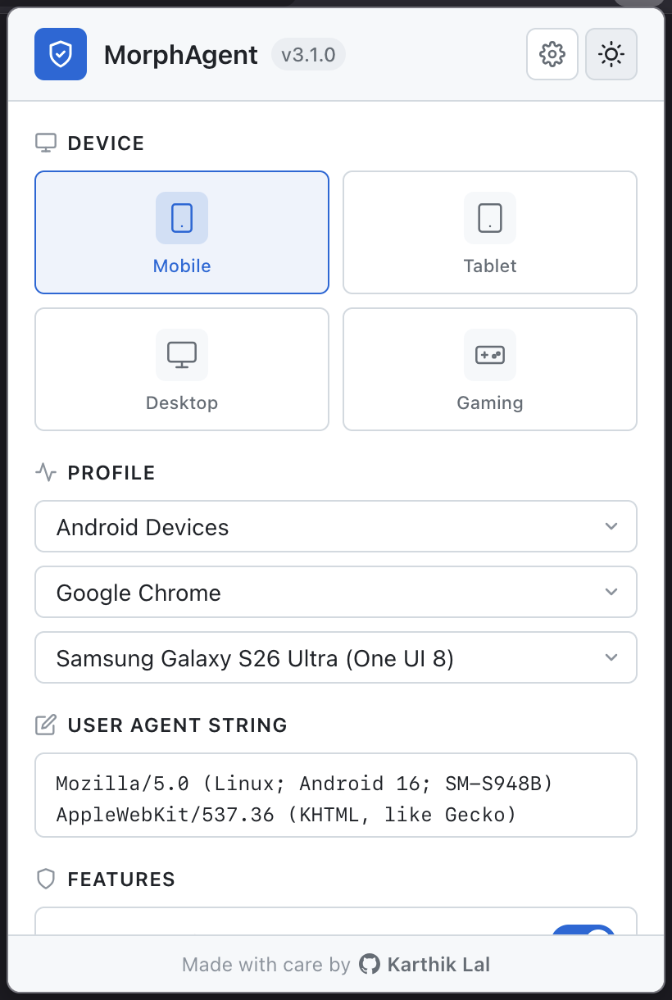
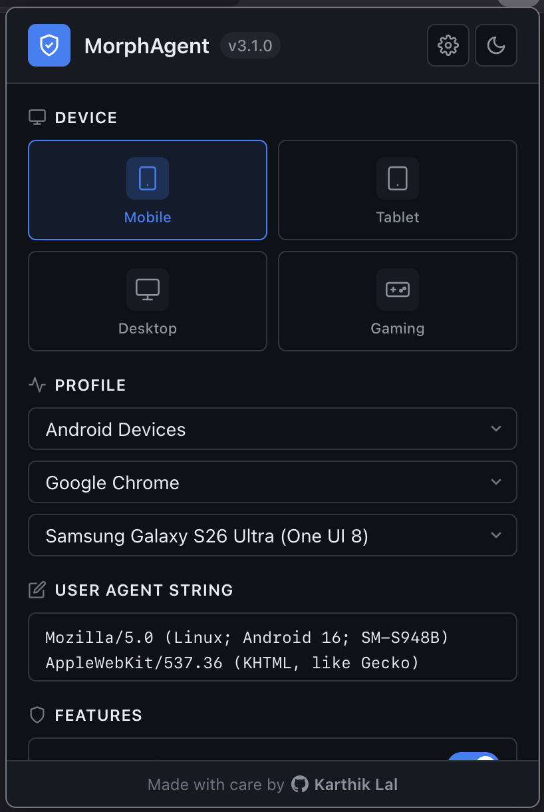
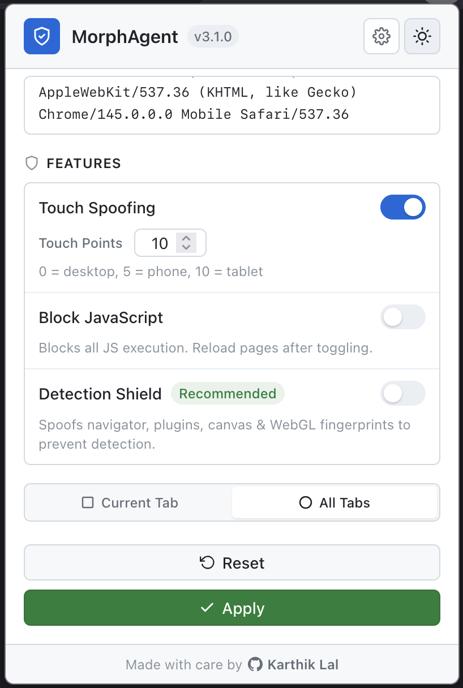
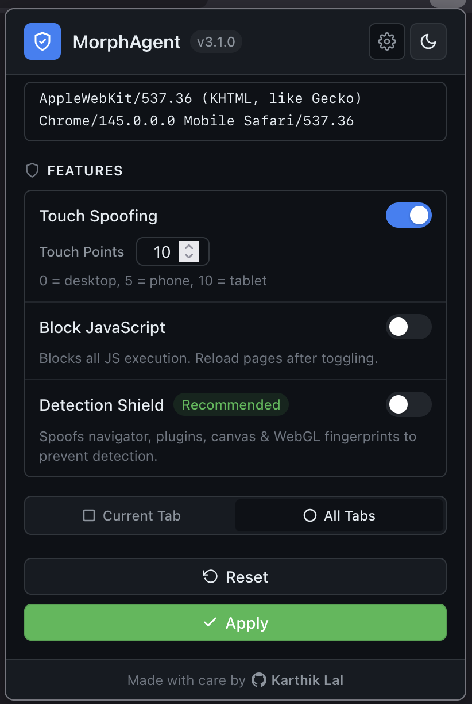

<div align="center">


# MorphAgent

> **Modern User Agent & Anti-Fingerprinting Suite for Chrome, Edge & Firefox**  
> 100% Chromium (Manifest V3) & Firefox Dual Engine with 10 Ultimate Stealth Protections


---

## **Official Firefox Extension**

MorphAgent is available on the official Mozilla Firefox Add-ons store.

<a href="https://addons.mozilla.org/en-US/firefox/addon/morphagent/" target="_blank">
  
</a>

</div>

## **Screenshots**

<div align="center">

<table>
   <tr>
      <th colspan="2" style="text-align:center; font-size:1.1em;">Main Interface (Light & Dark Mode)</th>
   </tr>
   <tr>
      <td>
         
         <div>Light Mode</div>
      </td>
      <td>
         
         <div>Dark Mode</div>
      </td>
   </tr>
   <tr>
      <th colspan="2" style="text-align:center; font-size:1.1em;">Features Overview</th>
   </tr>
   <tr>
      <td>
         
         <div>Features (Light)</div>
      </td>
      <td>
         
         <div>Features (Dark)</div>
      </td>
   </tr>
</table>

</div>

---

## Overview

MorphAgent is a professional-grade browser spoofing and anti-fingerprinting extension engineered for Chromium (Chrome, Edge, Brave, Opera, Vivaldi) and Firefox. It provides zero-latency request header interception via Manifest V3 DeclarativeNetRequest dynamic rules, alongside 10 advanced JavaScript stealth matrix protections.

---

## What's New in Version 4.0

1. **Dual Engine Manifest V3 & Manifest Generator (`scripts/generate-manifest.js`)**  
   Automatically builds Manifest V3 for Chromium browsers and Manifest V2/V3 for Firefox with dynamic header spoofing.

2. **Client Hints (`Sec-CH-UA`) & `navigator.userAgentData` Synchronous Engine**  
   Full spoofing of `Sec-CH-UA`, `Sec-CH-UA-Mobile`, and `Sec-CH-UA-Platform` headers paired with synchronous `navigator.userAgentData.getHighEntropyValues()` injection.

3. **Deterministic Canvas & WebGL Stealth Matrix**  
   Domain-seeded noise algorithm for `toDataURL()`, `toBlob()`, and `getImageData()`. Spoofs `UNMASKED_VENDOR_WEBGL` and `UNMASKED_RENDERER_WEBGL` across WebGL 1.0 & 2.0 without triggering CreepJS or FingerprintJS heuristic detection.

4. **AudioContext Fingerprint Shield & WebRTC IP Leak Defense**  
   Imperceptible frequency noise injection into `AnalyserNode.getFloatFrequencyData` and local ICE candidate IP sanitization for WebRTC.

5. **GPS Geolocation & Location Spoofing Engine**  
   GPS coordinate mocking (`navigator.geolocation.getCurrentPosition` & `watchPosition`), city presets (New York, London, Tokyo, Paris, Sydney, San Francisco) and custom latitude/longitude inputs.

6. **Screen Resolution, Orientation & Font Metrics Matrix**  
   Device-accurate `screen.width`, `screen.height`, `screen.colorDepth`, `window.devicePixelRatio`, orientation, and canvas `TextMetrics` micro-variation.

7. **Custom Profile Builder Studio**  
   GUI in Advanced Settings to create, edit, save, and delete custom device profiles with custom Client Hints, touch points, screen size, and OS parameters.

8. **Real-Time Live Fingerprint Leak Inspector**  
   Embedded live testing inspector that evaluates active User-Agent, Client Hints, Canvas noise, Audio noise, WebGL GPU string, and WebRTC status in real time.

9. **Context Menu Fast Switcher & Toolbar Action Badges**  
   Right-click context menu options for instant profile switching (`iPhone 17`, `Chrome 145`) and live action badge indicators (`MOB`, `TAB`, `DES`, `GAM`).

10. **Futuristic Animated UI**  
    Glassmorphic interface featuring a sleek red accent theme, quick search profile filter, keyboard shortcuts, and dark/light modes.

11. **Standalone Feature Mode (Independent Feature Toggles)**  
    Allows users to run individual features (Location Spoofing, Touch Spoofing, Block JavaScript, Detection Shield) independently without modifying or overriding the browser's real User-Agent flag.

---

## **Quick Start**

1. Click the MorphAgent icon in your browser toolbar
2. Select device category: Mobile, Tablet, Desktop, or Gaming  
3. Choose specific profile from the device grid
4. Toggle touch spoofing (automatically sets appropriate touch points)
5. Apply changes - refresh pages to see the new user agent

### Advanced Configuration
Click **"Advanced Settings"** for power-user features:
- **Website Rules**: Set automatic profiles for specific domains with wildcard support
- **Block List**: Disable spoofing on sensitive sites
- **Tab-Specific Settings**: View, copy, and manage per-tab UA overrides
- **Import/Export**: Backup and share your configuration as JSON
- **Custom User Agents**: Enter any UA string manually
- **Open Extension Debugging**: Quick shortcut to debugging pages
- **Reset All Settings**: Factory reset with confirmation

---

## Manifest Generator Script

MorphAgent includes a Node.js build script to generate manifest files for specific browser targets:

```bash
# Generate both Chrome Manifest V3 and Firefox Manifest V2/V3
npm run build:manifest

# Build and package for Firefox (creates morph-agent-firefox.zip)
npm run build:firefox

# Generate individually:
npm run build:chrome
```

---

## Installation

### Chromium Browsers (Chrome, Edge, Brave, Opera, Vivaldi)

1. Clone or download this repository:
   ```bash
   git clone https://github.com/karthik558/MorphAgent.git
   cd MorphAgent
   ```
2. Generate the Chrome Manifest V3 configuration:
   ```bash
   npm run build:chrome
   ```
3. Open the extension management page in your browser:
   - Chrome: `chrome://extensions/`
   - Edge: `edge://extensions/`
   - Brave: `brave://extensions/`
4. Enable **Developer mode** in the top right corner.
5. Click **Load unpacked** and select the `MorphAgent` project directory.

---

### Mozilla Firefox

**Option 1: Official Store**
Install it directly from the [Firefox Add-ons Store](https://addons.mozilla.org/en-US/firefox/addon/morphagent/).

**Option 2: Manual Installation**
1. Generate the Firefox Manifest configuration and package it:
   ```bash
   npm run build:firefox
   ```
2. Navigate to `about:debugging#/runtime/this-firefox` in Firefox.
3. Click **Load Temporary Add-on...**
4. Select `manifest.json` (or `morph-agent-firefox.zip`) from the project directory.

---

## Privacy & Stealth

- **Local Storage Only** — Zero telemetry, zero analytics, zero external dependencies.
- **100% Native Cloaking** — All spoofed JavaScript methods pass `Function.prototype.toString()` native code checks.
- **Block List & Per-Site Rules** — Exclude sensitive domains (e.g., banking portals) with wildcard matching.

---

## **Known Limitations**

- **Content Security Policy**: Some sites with strict CSP may limit content script injection
- **Touch API Scope**: Only affects `navigator.maxTouchPoints`
- **Banking Sites**: Recommended to use block list for financial websites

---

## License

Licensed under the [MIT License](LICENSE). 

## Author

**Developed by KARTHIK LAL**
- GitHub: [@karthik558](https://github.com/karthik558)
- Design: Modern interface with dark/light themes
- Features: Advanced per-site spoofing with Detection Shield
- Database: Comprehensive device profile collection (130+ profiles)
- UX: Enhanced user experience and professional polish

<div align="center">

**Built with ❤️ for developers who value browser privacy and testing**

*MorphAgent - Transform your browser identity with professional-grade spoofing & anti-fingerprinting*

**⭐ Star this repo if MorphAgent helps your development workflow!**

</div>